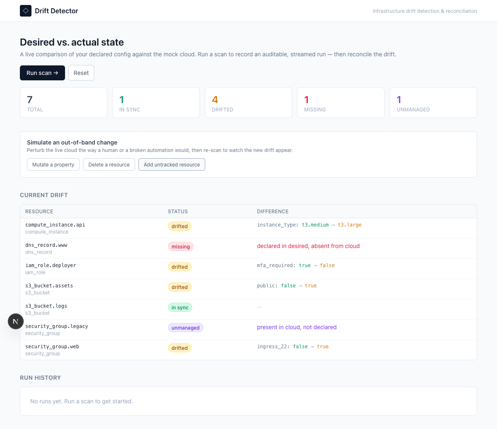
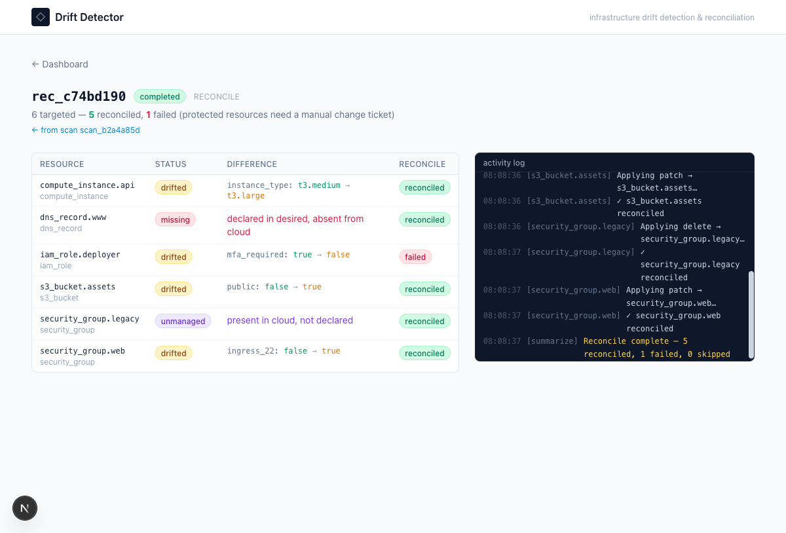

# Drift Detector

A local-first **infrastructure drift detection & reconciliation** tool. Declare your
desired state, scan a mock cloud to see exactly what has drifted, and reconcile it back —
with every step streamed live to an operator UI.

> Think of it as a tiny, self-contained Terraform/GitOps reconciliation loop: the part
> that answers *"does reality still match what we declared, and can I safely fix it?"*



---

## Why this use case

What's declared in your IaC inevitably stops matching what's actually running — someone
hot-patches a resource in the console, an automation half-fails, a security group gets
opened "just for a minute." This **drift** is invisible until it bites you during an
incident or an audit.

Detecting drift, understanding *exactly* what changed, and converging back to the declared
state safely is the core job of Terraform, Pulumi, and GitOps controllers. It's a real
platform-engineering pain point with a naturally rich workflow — and it's small enough to
execute thoroughly rather than ambitiously-but-superficially.

The tool is deliberately **scoped to one reconciliation loop, done well**: real state
management, real failure handling, and a UI that makes the system's behavior transparent.

## What it does

The system models two workflows over a mock cloud, each a persisted, streamed state machine:

- **Scan (detect)** — `load desired → refresh actual (per-resource, live) → classify → summarize`.
  Every resource is classified as `in_sync`, `drifted`, `missing`, or `unmanaged`, with the
  exact per-property diff captured.
- **Reconcile (remediate)** — converges actual state back to desired: `drifted → patch`,
  `missing → recreate`, `unmanaged → delete or import`. Each resource is applied
  independently, so one failure doesn't abort the rest.

### Things you can demo

| | Steps | Outcome |
|---|---|---|
| 🔍 **Detect** | the seed ships with built-in drift → **Run scan** | report: in_sync / drifted / missing / unmanaged + diffs |
| ✅ **Converge** | **Reconcile all** | live cloud patched/recreated/deleted; re-scan shows everything in sync |
| ⚠️ **Partial failure** | reconcile includes the protected `iam_role.deployer` | that one resource fails gracefully ("needs a manual change ticket"); the rest still converge |
| 🧪 **Live drift** | **Simulate an out-of-band change** → re-scan | new drift appears, exactly as it would in reality |



## Quick start

**Prerequisites:** Node **≥ 23.4** (the backend uses the built-in `node:sqlite` — no native
build, no DB to install). Node 22.5–23.3 also works if you prefix commands with
`NODE_OPTIONS=--experimental-sqlite`. No cloud accounts or API keys are needed.

```bash
# 1. install (npm workspaces — installs all three packages)
npm install

# 2. run backend (:3001) and frontend (:3000) together
npm run dev
```

Then open **http://localhost:3000**.

You can also run the two sides independently:

```bash
npm run dev:api    # backend only, on :3001
npm run dev:web    # frontend only, on :3000
```

The frontend talks to the backend at `http://127.0.0.1:3001` by default; override with
`NEXT_PUBLIC_API_BASE`. Backend state lives in `backend/data/drift.db` (auto-created,
git-ignored); delete it or hit **Reset** in the UI to return to the seeded baseline.

### Tests

```bash
npm test            # backend engine unit tests (node:test)
```

The suite covers classification of every drift class, exact diffing, reconcile convergence,
the protected-resource partial failure, `import` vs `delete` for unmanaged resources, and
crash recovery of interrupted runs.

## Architecture at a glance

Clean separation between **UI**, **API**, and **engine**, in an npm-workspaces monorepo.
Full write-up in **[docs/ARCHITECTURE.md](docs/ARCHITECTURE.md)**.

```
shared/     TypeScript types + the pure classify()/diff helpers (imported by both sides)
backend/    Fastify API + drift engine + SQLite store
  domain/   classify() + scan/reconcile engines (state machines) — pure, unit-tested
  infra/    MockCloud: live actual-state provider (apply/delete/refresh/simulate) + seed
  store/    Store interface + node:sqlite implementation (swappable)
  events/   in-process EventBus (engine → SSE)
  api/      Fastify routes (REST + SSE)
frontend/   Next.js (App Router) + Tailwind
  app/                dashboard + /runs/[id] live run view
  lib/ components/    API client, useRun (REST seed + SSE tail), badges, tables, console
```

Key ideas:

- **The engine never touches HTTP.** It persists through the `Store` interface and announces
  every transition on an in-process `EventBus`. REST issues commands and reads state; the
  **SSE** endpoint subscribes to the bus. So the core is fully testable without a server, and
  live progress is decoupled from request/response.
- **Event replay + live tail.** On SSE connect the server replays the run's persisted events,
  then streams new ones (subscribing *before* replay and de-duping by id), so a refresh or a
  late subscriber still sees full history. REST stays the source of truth; the stream is an
  optimization.
- **Drift as a domain property.** A version can be a broken/protected resource and
  "out-of-band change" is a first-class action — failure is realistic and operator-driven,
  not a debug toggle.

## API

| Method | Path | Purpose |
|--------|------|---------|
| `GET`  | `/api/state` | current desired vs. actual inventory |
| `GET`  | `/api/runs` | run history |
| `GET`  | `/api/runs/:id` | a run + its drift items + event log |
| `GET`  | `/api/runs/:id/events` | **SSE** live progress (replay + tail) |
| `POST` | `/api/scans` | start a scan |
| `POST` | `/api/reconciles` | start a reconcile (`{ scanId, items? }`; omit items to reconcile all) |
| `POST` | `/api/simulate` | introduce out-of-band drift (`{ kind: mutate \| delete \| create }`) |
| `POST` | `/api/reset` | reset to the seeded baseline |

## Data model (SQLite)

`desired_resources` and `actual_resources` (the live cloud), `runs` (scan | reconcile),
`drift_items` (per-resource classification + diff + reconcile status), and an append-only
`events` feed that drives both SSE replay and the audit trail. Details in
[docs/ARCHITECTURE.md](docs/ARCHITECTURE.md).

## What I'd build next

Given more time, in rough priority order:

1. **Re-verify after reconcile, automatically.** Today the operator re-scans to confirm
   convergence; the reconcile run could chain a verification scan and report a single
   converged/not-converged verdict.
2. **A real provider plugin behind `MockCloud`.** The `Store` and provider are already
   interfaces; a read-only AWS/Terraform-state adapter would make this genuinely useful
   without touching the engine.
3. **Drift history & alerting.** Persisted scans already give a timeline — surface "this
   resource has been drifting for 3 days" and webhook/Slack on first detection.
4. **Scheduled scans.** A cron loop that scans every N minutes turns this from on-demand into
   continuous drift monitoring.
5. **Per-property reconcile & richer diffs.** Reconcile a single property, and diff nested
   objects rather than flat property bags.
6. **AuthN/Z + multi-environment.** Per-environment desired state and an approval gate before
   reconciling production (the engine's suspend/resume seam already supports gating).
7. **Resilience hardening.** Retries/backoff on flaky provider calls, and resuming
   (rather than failing) interrupted runs on boot.

## AI collaboration

This project was built with AI as an engineering collaborator (as the assessment requires).
The decision log — what was directed vs. delegated, the use-case pivots, and the
course-corrections (e.g. dropping vitest for `node:test` over a `node:sqlite` resolution
issue, and fixing an empty-body-POST 400) — is in
**[docs/AI-INTERACTION-LOG.md](docs/AI-INTERACTION-LOG.md)**.
